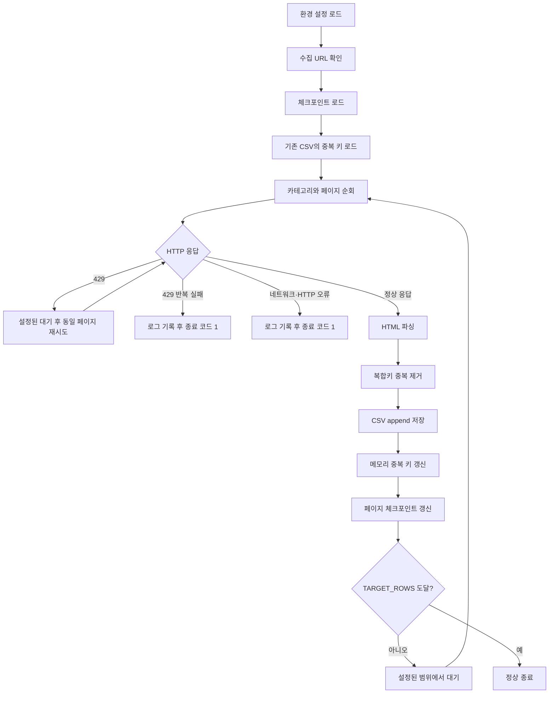

# Book Data Pipeline

외부 도서 목록 웹 소스에서 책 데이터를 수집해 CSV 데이터셋으로 만드는 작은 수집 파이프라인입니다. 더미 데이터 생성 대신 실제 목록을 사용하되, 프로젝트 규모에 맞춰 Python 표준 기능과 최소한의 라이브러리만 사용합니다.

> 본 프로젝트는 웹 크롤링과 데이터 수집 파이프라인을 학습하기 위한 개인 프로젝트입니다. 실행 전 대상 사이트의 최신 `robots.txt`, 이용약관, API 및 접근 정책을 직접 확인해야 합니다. 자세한 내용은 [크롤링 정책 및 운영 원칙](docs/crawling-policy.md)을 참고하세요.

## 핵심 기획

- 목표: 전체 `TARGET_ROWS`만큼의 고유 도서 데이터 수집
- 수집 범위: 환경 설정에 정의된 카테고리별 수집 범위를 순회하고 전체 목표에 도달하면 종료
- 저장소: CSV append 방식
- 체크포인트: 마지막으로 저장에 성공한 카테고리와 페이지를 JSON에 기록
- 멱등성: 기존 CSV와 현재 페이지의 복합키를 비교해 중복 저장 방지
- 요청 정책: 설정된 요청 간 대기, `429` 응답 시 동일 페이지 재시도, 반복 실패 시 종료 코드 `1`
- 실패 정책: URL·네트워크 오류도 로그를 남기고 종료 코드 `1` 반환

현재 과제의 중복 기준은 다음 네 필드의 조합입니다.

```text
(title, primary_author, publisher, published_date)
```

상품·에디션 단위의 엄밀한 식별이나 데이터베이스 기반 운영은 이 프로젝트의 범위에 포함하지 않습니다.

## 동작 순서



재실행 시에는 저장된 체크포인트의 다음 페이지부터 시작하고, CSV에서 읽은 중복 키를 함께 사용합니다. 따라서 이미 저장된 페이지를 다시 읽더라도 동일한 레코드를 다시 append하지 않습니다.

## 폴더 구조

```text
.
├── src/
│   ├── main.py                    # 전체 파이프라인 orchestration
│   ├── common.py                  # 공통 logger와 timestamp
│   └── crawling/
│       ├── collector.py           # HTTP 요청, URL 확인, 429 처리
│       ├── parser.py              # HTML 파싱과 도서 필드 추출
│       ├── deduplicator.py        # 복합키 생성과 중복 제거
│       ├── writer.py              # CSV append 저장
│       └── checkpoint.py          # 체크포인트 저장과 복구
├── config/
│   └── logrotate.conf             # 로그 보관 설정 예시
├── docs/
│   ├── crawling-policy.md         # 크롤링 정책 및 운영 원칙
│   └── idempotency.md             # 재실행·체크포인트 정책 요약
├── .env.example                   # 실행 설정 예시
└── README.md
```

실행 중 생성되는 CSV와 체크포인트의 위치는 각각 `LOADING_PATH`, `CHECKPOINT_PATH`로 지정합니다. 로그는 `logs/book-data-pipeline.log`에 터미널 출력과 함께 기록됩니다.

## 실행

```bash
conda activate sandbox
PYTHONPATH=src python src/main.py
```
